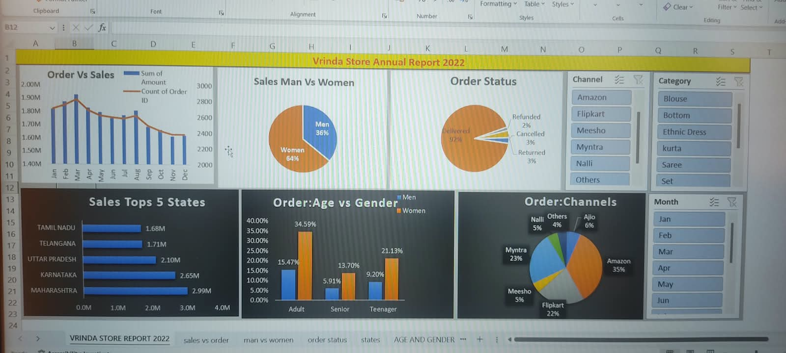

# Vrinda Store - Sales Data Analysis and Dashboard | Excel Project

## 📊 About The Project
This project is a comprehensive sales data analysis for Vrinda Store, a retail store. The goal was to analyze sales performance, understand customer trends, and create an interactive dashboard for business decision-making using Microsoft Excel.

## 📁 Dataset
The dataset contains sales transactions for the year 2022 for Vrinda Store including:
- Order Details, Customer Details, Product Category
- Sales, Profit, Discount, Order Date, Location

## 🛠️ Tools & Functions Used
- **Microsoft Excel**
- Data Cleaning: Remove Duplicates, Text to Columns, Find & Replace
- Data Analysis: Pivot Tables, Pivot Charts, VLOOKUP, IF, SUMIFS, AVERAGE
- Dashboard Features: Slicers, Timeline, Conditional Formatting, Charts

## 📈 Key KPIs Analyzed
- Total Sales, Total Profit, Total Orders
- Sales by Category, Sub-Category, and Region
- Monthly Sales Trend
- Top 10 Customers by Sales
- Sales vs Profit Analysis
- Customer Segment Analysis
